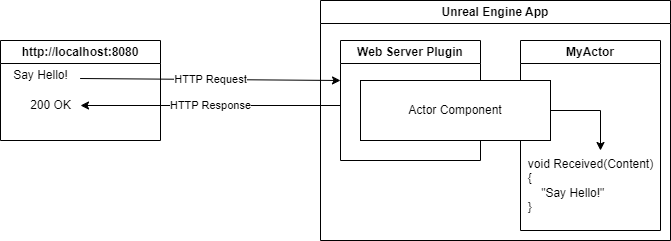
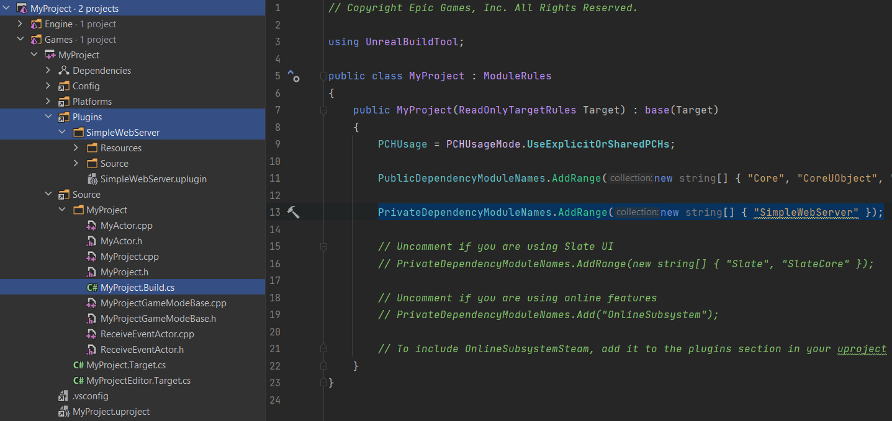
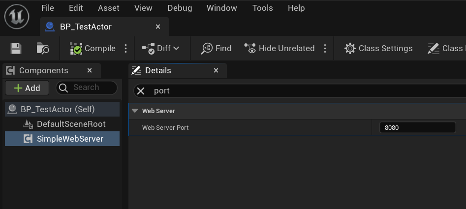
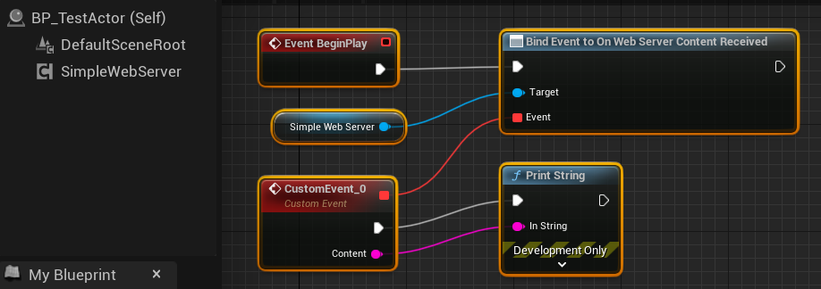
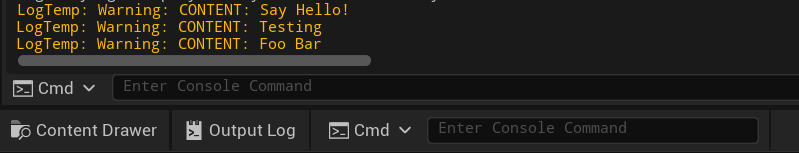
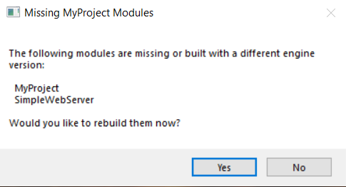
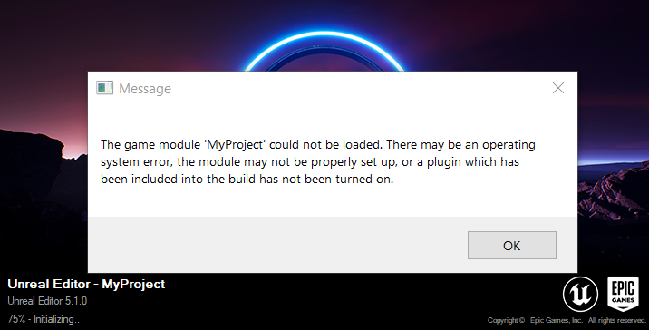
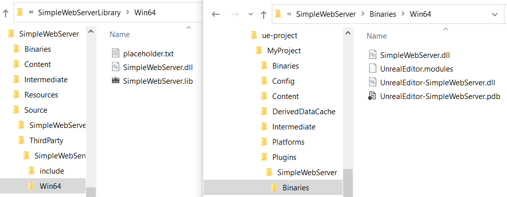
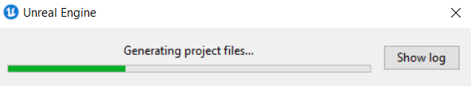

# Unreal Engine Plugin: SimpleWebServer

## About
With this plugin you can enable a web server inside of your Unreal Engine project. Your C++ or Blueprint will be notified when a user sends HTTP GET or POST requests to your project. You can submit data from outside with HTTP requests and let you project process it.

This plugin only accepts HTTP requests and does not send anything back. One-way channel to feed data to your project. However, it can probably be modified to reply with your own response.

The current plugin version is for Windows. But you can contribute with Linux or Mac plugin libraries. There is the step-by-step video of the plugin creation with Microsoft Visual Studio, please use it as a guide.  

## Features
* Basic web server with HTTP/1.1
* Accepts GET and POST requests
* UE components to receive data sent to the web server
* Your Actor receives data sent to the web server



## Setup
Provided your UE project name is `MyProject`
* [Download the latest version](https://github.com/TODO) of the Plugin and unzip it
* Copy/Paste `SimpleWebServer` plugin to your Plugins directory
* Add "SimpleWebServer" to `MyProject.Build.cs`
* Start the UE and create an Actor, then add `SimpleWebServer` to its components
* This component will throw `OnWebServerContentReceived` event, which you need to bind to (C++ and Blueprint examples follow)




### C++ example
```
AMyActor::AMyActor()
{
  WebServerComponent = CreateDefaultSubobject<USimpleWebServerComponent>(TEXT("WebServer"));
  WebServerComponent->OnWebServerContentReceived.AddUObject(this, &AReceiveEventActor::OnContentReceived);
}

void AMyActor::OnContentReceived(FString& Content)
{
  UE_LOG(LogTemp, Warning, TEXT("CONTENT: %s"), *Content);
}
```

### Blueprint example


### Trying it out
* Drag your Actor to the scene and hit Play

`curl -d "Say Hello!" -X POST http://localhost:8080`



## Building from source
* Clone the repository and `cd SimpleWebServer-Plugin`
* Double click on `ue-project\MyProject\MyProject.uproject` and choose `Yes` to build the project, the build will fail but it will create required directories




* Open VS project by clicking on `vs-project\SimpleWebServer\SimpleWebServer.sln`
* Build solution for `Release`, this will create the following 2 files in `vs-project\SimpleWebServer\x64\Release`
** SimpleWebServer.dll
** SimpleWebServer.lib
* Copy those 2 files to `ue-project\MyProject\Plugins\SimpleWebServer\Source\ThirdParty\SimpleWebServerLibrary\Win64`
```
copy vs-project\SimpleWebServer\x64\Release\*.dll ue-project\MyProject\Plugins\SimpleWebServer\Source\ThirdParty\SimpleWebServerLibrary\Win64
copy vs-project\SimpleWebServer\x64\Release\*.lib ue-project\MyProject\Plugins\SimpleWebServer\Source\ThirdParty\SimpleWebServerLibrary\Win64
```
* Copy DLL file to `ue-project\MyProject\Plugins\SimpleWebServer\Binaries\Win64`
```
copy vs-project\SimpleWebServer\x64\Release\*.dll ue-project\MyProject\Plugins\SimpleWebServer\Binaries\Win64
```
* Also copy `sws.h` Header file to `ue-project\MyProject\Plugins\SimpleWebServer\Source\ThirdParty\SimpleWebServerLibrary\include`
```
copy vs-project\SimpleWebServer\SimpleWebServer\sws.h ue-project\MyProject\Plugins\SimpleWebServer\Source\ThirdParty\SimpleWebServerLibrary\include
```

* Right click on `ue-project\MyProject\MyProject.uproject` and choose `Generate Visual Studio project files`, this will create `MyProject.sln`

* This should be enough to load the project in UE, try to double click on `ue-project\MyProject\MyProject.uproject`
* Otherwise, open the solution `ue-project\MyProject\MyProject.sln` and rebuild from IDE

## Resources
* C++ project this plugin is built on
[Simple-Web-Server](https://gitlab.com/eidheim/Simple-Web-Server)

* Step-by-step video of building this plugin
[YouTube](https://example.org)

## License
This code is open source software licensed under the [GNU Lesser General Public License v3](http://www.gnu.org/licenses/lgpl-3.0.en.html).
